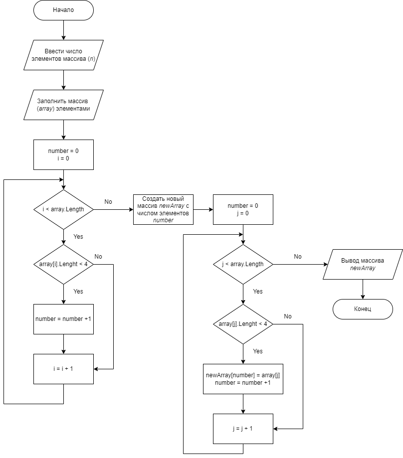

## Задача
Написать программу, которая из имеющегося массива строк формирует новый массив из строк, длина которых меньше либо равна 3 символа. Первоначальный массив можно ввести с клавиатуры, либо задать на старте выполнения алгоритма. При решении не рекомендуется пользоваться коллекциями, лучше обойтись исключительно массивами.
## Решение
1. Ввод данных осуществляется с клавиатуры. Первоначально у пользователя запрашивается количество элементов массива, которые он хочет задать, далее с помощью метода массив заполняется элементами с помощью ввода строк с клавиатуры.
2. С помощью метода производится подсчет элементов созданного массива длина которых не превышает трех символов, далее основываясь на этом подсчете, создается новый массив, размер которого соответствует числу элементов, длина котороых не превышает трех символов, и новый массив заполняется элементами - строками оригинального массива длина которых не превышает трех символов.
## Алгоритм
Ниже представлен алгоритм решения задачи:
